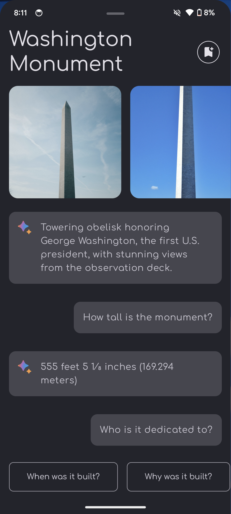
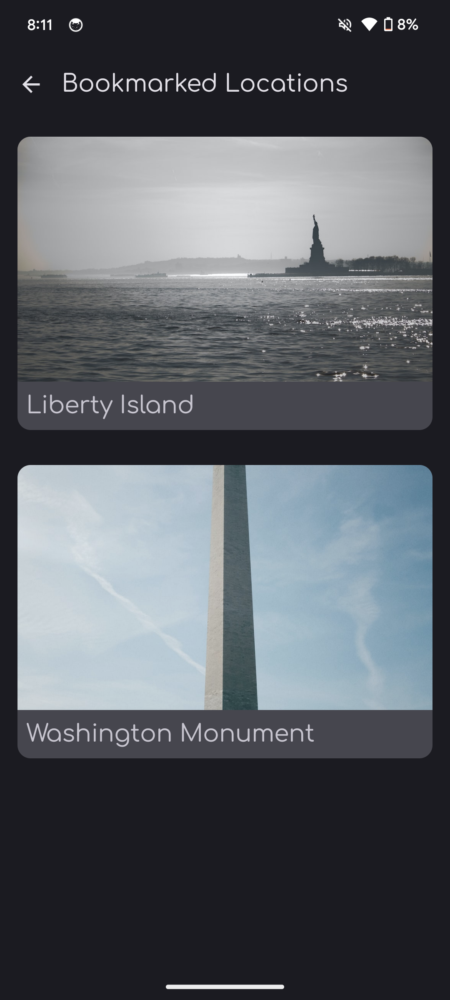
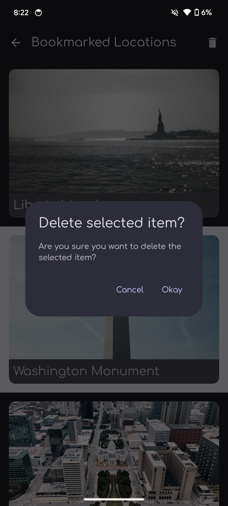
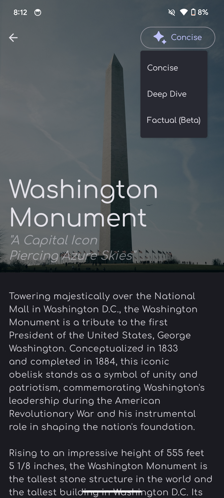
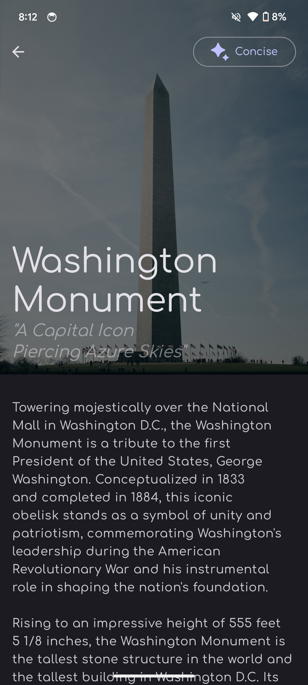

# Lookup - A fully AI powered Landmarks Recognition App

<p align = "center">
<a href="https://www.repostatus.org/#active"></a>  
</p>

Lookup is a fully AI powered Android app that lets you explore the world's wonders in a whole new way! Simply take a photo of a famous monument, and the app will
instantly recognize it and generate fascinating descriptions, answer your questions, and even write unique articles with your preferred writing tone about the place. 

## Table of Contents
1. [Demo](#demo)
2. [Screenshots](#screenshots)
3. [Tech Stack](#tech-stack)
4. [Remote API's / Client SDK's](#remote-apis--client-sdks)
5. [Nptable Features](#notable-features)
6. [Source code, Architecture, & Testing](#source-code-architecture--testing)
7. [Underlying Model](#underlying-model)
8. [Building and running the app](#building-and-running-the-app)

## Demo
https://github.com/technophilist/Lookup/assets/54663474/25ff77dd-4110-4165-b470-c2613e7112eb

## Screenshots
   

  

## Tech Stack
- Entirely written in [Kotlin](https://kotlinlang.org/).
- [CameraX](https://developer.android.com/training/camerax) for accessing and processing the images captured from the camera.
- [TensorFlow Lite](https://www.tensorflow.org/lite/inference_with_metadata/task_library/overview) for image recognition.
- [Hilt](https://www.google.com/url?client=internal-element-cse&cx=000521750095050289010:zpcpi1ea4s8&q=https://developer.android.com/training/dependency-injection/hilt-android&sa=U&ved=2ahUKEwiW5omeu6z4AhWRR2wGHVUsCo0QFnoECAMQAQ&usg=AOvVaw3dCbP79C6od3KVCnJub3v0) for dependency injection.
- [Jetpack Compose](https://developer.android.com/jetpack/compose) for UI and navigation.
- [Coil compose](https://coil-kt.github.io/coil/compose/) for image loading and caching.
- [Coil-gif](https://coil-kt.github.io/coil/gifs/) for loading and displaying gif's.
- [Lottie compose](https://github.com/airbnb/lottie/blob/master/android-compose.md) for displaying animations.
- [Kotlin Coroutines](https://kotlinlang.org/docs/reference/coroutines/coroutines-guide.html) for threading.
- [Kotlin Flows](https://developer.android.com/kotlin/flow) for creating reactive streams.
- [Work Manager](https://developer.android.com/topic/libraries/architecture/workmanager?gclid=EAIaIQobChMIwJy33ufG8QIVGcEWBR31Mwa-EAAYASAAEgIF3vD_BwE&gclsrc=aw.ds) for persistent long-running background tasks.
- [Retrofit](https://square.github.io/retrofit/) for communicating with the OpenAI API.
- [Room](https://developer.android.com/training/data-storage/room) for database.
- Moshi + Moshi Kotlin CodeGen for deserializing responses from the API.
- Uses [Kotlin Gradle DSL](https://docs.gradle.org/current/userguide/kotlin_dsl.html).

## Underlying Model
Under the hood, the app uses the [classifier-north-america-v1 image classifier built by Google](https://www.kaggle.com/models/google/landmarks/frameworks/tensorFlow1/variations/classifier-north-america-v1).
So, the app will be able to recognize all the famous landmarks in the north america region that the classifier was trained to identify.

## Remote API's / Client SDK's
- [Gemini Client SDK](https://ai.google.dev/tutorials/android_quickstart) 
- [OpenAI API](https://openai.com/blog/openai-api)
- [Unsplash API](https://unsplash.com/developers)

## Notable features
<dl>
  <dt>Haptic Feedback 🪄</dt>
  <dd>The app subtly improves the user-experience by leveraging the on-device vibration actuators to provide a haptic feedback when certain events occur in the app such as clicking the shutter button or displaying the bottom sheet once the app has recognized the landmark.</dd>

  <dt>Dynamic Colors & Light/Dark Themes 🎨</dt>
  <dd>The app not only supports dynamic colors on devices that support it, but also switches to separate defined light and dark themes (based on whether the device is in dark / light mode) helping it to provide a more cohesive user experience.</dd>

  <dt>Themed App Icons (Android 13+) 🌈</dt>
  <dd>The app also supports the "Themed Icons" feature available on Android 13 and later. If the user has opted in for the feature on a device that is running Android 13 and higher, the app's icon will be tinted to inherit the coloring of the user’s chosen wallpaper and other themes.</dd>

  <dt>Intelligent Caching 🔮</dt>
  <dd>The app caches the results of many API calls helping to not only improve the average response time, but also to reduce the number of calls being made to the underlying RESTful services. Moreover, the app also leverages WorkManger to prefetch the different articles associated with a specific bookmarked location before the user even navigates to the detail screen where the article(s) are displayed. This helps in reducing the average Time To Initial Display (TTID) of the associated screen.</dd>

  <dt>Meta Prompting 🤖</dt>
  <dd>The app uses the technique of meta-prompting to display possible questions (as a suggestion chip) that a user might have about a specific identified location.</dd>
</dl>

## Source code, Architecture, & Testing
- Uses multi-repository pattern.
- Commit messages follow the [Conventional Commits](https://www.conventionalcommits.org/en/v1.0.0/) specification.
- Consists of unit tests that predominantly test the data layer.

## Building and running the app
1. Create an unsplash developer account and get the api token from https://unsplash.com/documentation.
2. In the `local.properties` file of your project add the api key as shown below.
```properties
UNSPLASH_API_ACCESS_KEY = PASTE-YOUR-TOKEN-HERE
```
3. The app can be made to either use [Gemini](https://ai.google.dev) or [Chat-GPT](https://openai.com/blog/introducing-chatgpt-and-whisper-apis)
for it's contextual text generation features. To use either of the two, make sure to get the access / api key for the chosen LLM service,
and paste it in the `local.properties` file as follows. For the service that you've chosen not to use,
make sure to enter a random string as the access key since the existence of both the keys are required
for the app to build.
```properties
UNSPLASH_API_ACCESS_KEY = PASTE-YOUR-TOKEN-HERE
GOOGLE_GEMINI_API_KEY = PASTE-YOUR-TOKEN-HERE
```
5. By default, the app uses Gemini for text generation. If you want to use Chat-GPT, then replace the '@GeminiClient'
di qualifier with the `@OpenAiClient` qualifier in all places where an instance of `TextGeneratorClient` is
injected.
6. Build the app and run it.
