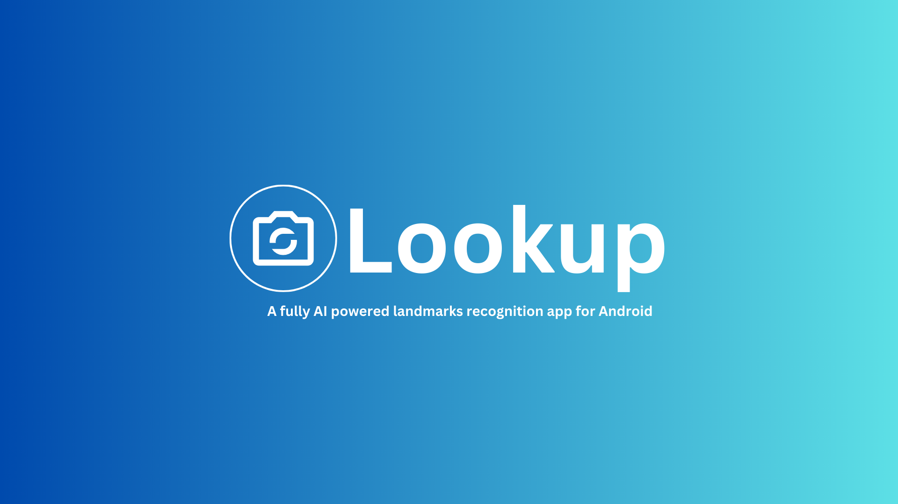

# Lookup - A fully AI powered Landmarks Recognition App

Lookup is a fully AI powered Android app that lets you explore the world's wonders in a whole new way! Simply take a photo of a famous monument, and the app will
instantly recognize it and generate fascinating descriptions, answer your questions, and even write unique articles with your preferred writing tone about the place. 

## Tech Stack
- Entirely written in [Kotlin](https://kotlinlang.org/).
- [CameraX](https://developer.android.com/training/camerax) for accessing and processing the images captured from the camera.
- [TensorFlow Lite](https://www.tensorflow.org/lite/inference_with_metadata/task_library/overview) for image recognition.
- [Hilt](https://www.google.com/url?client=internal-element-cse&cx=000521750095050289010:zpcpi1ea4s8&q=https://developer.android.com/training/dependency-injection/hilt-android&sa=U&ved=2ahUKEwiW5omeu6z4AhWRR2wGHVUsCo0QFnoECAMQAQ&usg=AOvVaw3dCbP79C6od3KVCnJub3v0) for dependency injection.
- [Jetpack Compose](https://developer.android.com/jetpack/compose) for UI and navigation.
- [Coil compose](https://coil-kt.github.io/coil/compose/) for image loading and caching.
- [Coil-gif](https://coil-kt.github.io/coil/gifs/) for loading and displaying gif's.
- [Lottie compose](https://github.com/airbnb/lottie/blob/master/android-compose.md) for displaying animations.
- [Kotlin Coroutines](https://kotlinlang.org/docs/reference/coroutines/coroutines-guide.html) for threading.
- [Kotlin Flows](https://developer.android.com/kotlin/flow) for creating reactive streams.
- [Retrofit](https://square.github.io/retrofit/) for communicating with the OpenAI API.
- [Room](https://developer.android.com/training/data-storage/room) for database.
- Moshi + Moshi Kotlin CodeGen for deserializing responses from the API.

## Remote API's / Client SDK's
- [Gemini Client SDK](https://ai.google.dev/tutorials/android_quickstart) 
- [OpenAI API](https://openai.com/blog/openai-api)
- [Unsplash API](https://unsplash.com/developers)

## Source code, Architecture, & Testing
- Uses multi-repository pattern.
- Commit messages follow the [Conventional Commits](https://www.conventionalcommits.org/en/v1.0.0/) specification.
- Consists of unit tests that predominantly test the data layer.

